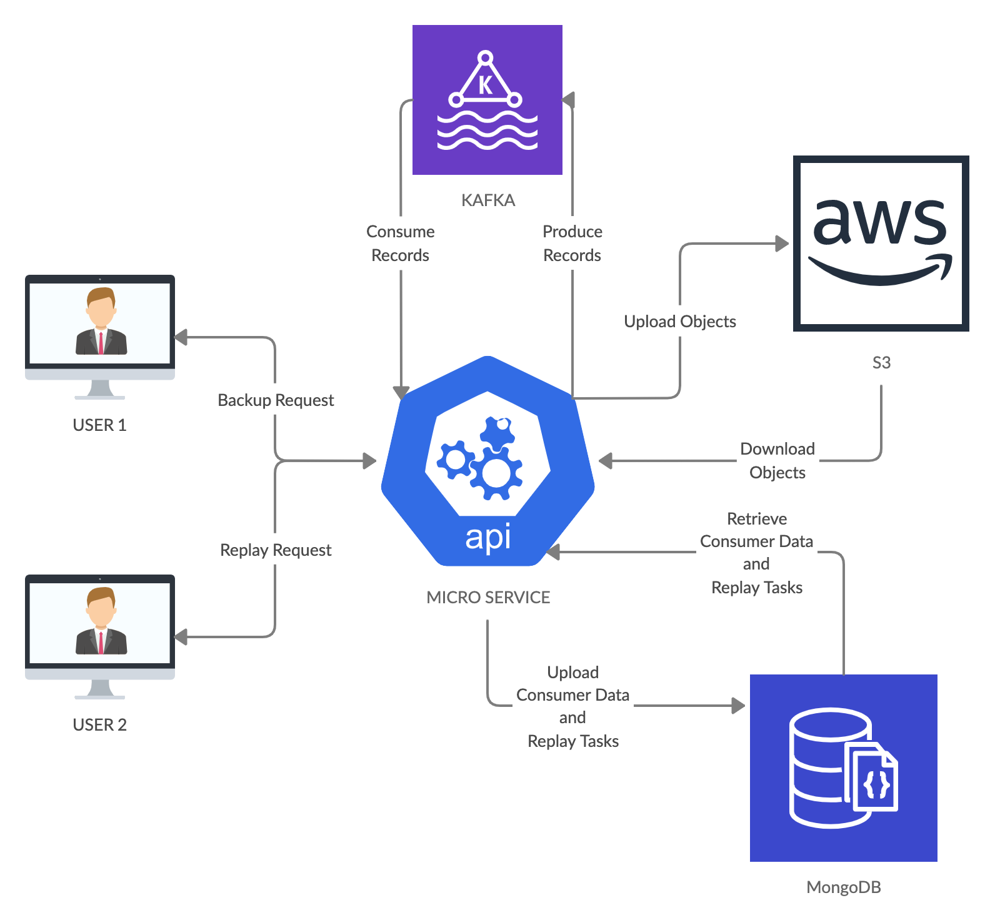

# KAFKA BACKUP AND REPLAY SERVICE

## This is a microservice which automatically backup Kafka topics onto AWS - S3 database for 30 days so that data can be retrieved from cloud whenever required.

## Core Functionalities:
### - Backup records from topics given by the user by uploading them into a S3 bucket
### - Produce records into new topics after downloading them from S3 bucket as specified by the user
### - Add retention policy of 30 days for each S3 bucket so that data gets deleted automatically

## Additional Insights
### - Parallel Streams are used for downloading objects from S3, filtering objects based on date interval and uploading replay tasks to mongoDB
### - 50 threads are used for continuous monitoring of mongoDB in order to find any unassigned task
### - Each task is assigned to exactly one idle thread without any consistency problems and if the service stops while processing, the task is reassigned again to some thread on startup
### - Replay tasks are sorted on the basis of assignment status for faster search results
### - Backup starts automatically on startup for topics stated by user in the past
### - Responsibility of each topic is assigned to separate thread so that they can be backed up concurrently contributing to good performance

## Workflow
